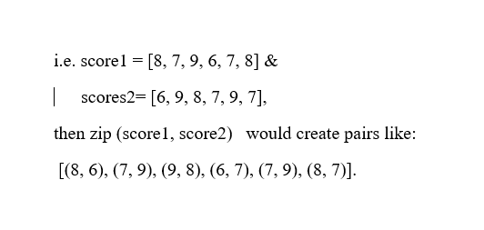

The script runs  a non-dominance analysis on a set of concepts based on respective scores.()
* A concept is non-dominant if no other concept consistently outperforms it in all critera. 

**_Script Logic and Implementation_**

     if all(s2 >= s1 for s1, s2 in zip(score1, score2)) and any (s2 > s1 for s1,s2 in zip(score1, score2)):
                is_dominated = True
                break

Here, 
- the if statement checks for both conditions together
-   all ensures  score2 is equal or greater than scores1

- any ensures score2 is strictly greater than score1

        Zip(score1, Score2)

- pairs each score in score1 with a corresponding score of score2

    all(s2 >= s1 for s1, s2 in zip(scores1, scores2))
Checks if score2 is equal or greater than score1 for each pair.
- If one pair doesnt satisfy, it returns false, meaning score2 does not dominate.

    any(s2 > s1 for s1, s2 in zip(scores1, scores2))
- Checks if score2 is greater than score1. If atleast there is one situation where S2>s1 then it returns true showing that scores2 is better in  atleast one criteron

    dominated = True
                break

- if score2 dominates score1 then is_dominated is true, else the break stops further comparison

       if  dominated:
        dominated.append(name1)
    else:
        non_dominated.append(name1)

- If a concept is found to be dominated, it goes into the dominated list.
- If a concept is found to be non-dominated, it goes into the non_dominated list.

- *These are the empty lists we created above i.e*

      dominated = []
      non_dominated = []

-  All  the concepts (A, B, C, D) are non-dominated, meaning they all offer unique trade-offs across attributes

refferences
https://www.w3schools.com/python/ref_func_zip.asp
